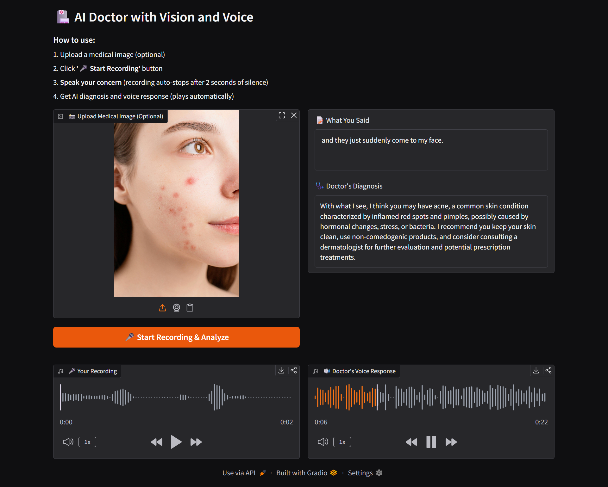

# 🏥 AI Medical Chatbot with Vision & Voice

[](https://www.python.org/downloads/)
[](https://gradio.app/)
[](https://groq.com/)

> **Final Year B.Tech Project** | Computer Science Engineering  
> An AI-powered medical assistant combining computer vision, NLP, and voice interaction for preliminary medical assessments.

**⚠️ Educational Project Only** - Not for actual medical diagnosis. Always consult healthcare professionals.



## 🎯 Project Overview

This project demonstrates the integration of multiple AI technologies to create an intelligent medical consultation system. Users can upload medical images and describe symptoms via voice, receiving AI-generated assessments through natural voice responses.

**Key Achievement**: Successfully integrated 3 different AI models (LLaMA-4 Scout for vision, Whisper for speech recognition, ElevenLabs for TTS) into a single cohesive application.

### 🌟 Features

- **🎤 Voice Input**: Auto-recording with silence detection (stops after 2s of silence)
- **📸 Image Analysis**: AI-powered medical image examination using vision-language models
- **🧠 Multimodal AI**: Combines visual + textual information for comprehensive analysis
- **🔊 Voice Output**: Natural TTS responses with automatic fallback
- **🌐 Web UI**: Clean Gradio interface, deployable anywhere
- **⚡ Real-time Processing**: End-to-end pipeline in under 10 seconds

## 🛠️ Tech Stack

| Component | Technology | Purpose |
|-----------|-----------|---------|
| Frontend | Gradio 4.44.0 | Web interface |
| Vision AI | LLaMA-4 Scout (17B) | Medical image analysis |
| Speech-to-Text | Groq Whisper Large V3 | Voice transcription |
| Text-to-Speech | ElevenLabs / gTTS | Voice synthesis |
| Backend | Python 3.8+ | Core logic |
| Audio Processing | SpeechRecognition, PyDub | Audio handling |

## 🚀 Quick Start

### Installation

```bash
# Clone the repository
git clone https://github.com/ChitrakshSuri/ai-medical-chatbot-with-vision-voice.git
cd ai-medical-chatbot-with-vision-voice

# Install dependencies
pip install -r requirements.txt

# Set up API keys
export GROQ_API_KEY="your_groq_api_key"
export ELEVENLABS_API_KEY="your_elevenlabs_key"  # Optional

# Run the application
python app.py
```

Visit `http://localhost:7860` in your browser.

### Getting API Keys (Free Tier Available)

1. **Groq API** (Required): Sign up at [console.groq.com](https://console.groq.com)
2. **ElevenLabs** (Optional): Get free credits at [elevenlabs.io](https://elevenlabs.io)
   - *System auto-falls back to gTTS if not configured*

## 📖 How to Use

1. **Upload Image** (optional) - Medical image showing your concern
2. **Click Record** - Press "🎤 Start Recording & Analyze"
3. **Speak** - Describe your symptoms (auto-stops after 2 seconds of silence)
4. **Get Results** - AI diagnosis + voice response plays automatically

**Example Query**: *"I have this rash on my arm for 3 days. It's red and itchy."*

## 🏗️ Project Architecture

```
User Interface (Gradio)
        |
        |-- Voice Input Module
        |   |-- Audio Recording (auto-stop)
        |   └── Groq Whisper STT
        |
        |-- Vision Module
        |   |-- Image Encoding (Base64)
        |   └── LLaMA-4 Scout Analysis
        |
        └── Voice Output Module
            |-- ElevenLabs TTS (primary)
            └── gTTS (fallback)
```

### File Structure

```
📦 ai-medical-chatbot-with-vision-voice
├── 📄 app.py                          # Main application entry point
├── 📄 brain_of_the_doctor.py          # Image analysis with Groq LLaMA-4
├── 📄 voice_of_the_patient.py         # Audio recording + Whisper STT
├── 📄 voice_of_the_doctor_updated.py  # TTS with ElevenLabs/gTTS
├── 📄 gradio_app.py                   # Gradio UI components
├── 📄 requirements.txt                # Python dependencies
└── 📄 README.md                       # Project documentation
```

## 🧪 Core Modules Explained

### 1. Brain of the Doctor (`brain_of_the_doctor.py`)
Handles image analysis using Groq's multimodal LLM:

```python
def analyze_image_with_query(query, encoded_image, model):
    """
    Sends image + text query to LLaMA-4 Scout
    Returns: Medical assessment text
    """
```

**Key Learning**: Base64 encoding for image transmission, API integration with multimodal models

### 2. Voice of the Patient (`voice_of_the_patient.py`)
Manages voice input with smart auto-stop:

```python
def record_audio(file_path, pause_threshold=2.0):
    """
    Records audio, stops after 2s silence
    """

def transcribe_with_groq(audio_filepath):
    """
    Converts speech to text using Whisper
    """
```

**Key Learning**: Real-time audio processing, silence detection algorithms

### 3. Voice of the Doctor (`voice_of_the_doctor_updated.py`)
Text-to-speech with intelligent fallback:

```python
def tts_elevenlabs(text):
    """
    Primary: ElevenLabs (premium)
    Fallback: gTTS (free)
    """
```

**Key Learning**: Error handling, graceful degradation, API fallback strategies

## ⚙️ Configuration

### Adjust Recording Sensitivity

In `voice_of_the_patient.py`:

```python
record_audio(
    timeout=10,              # Wait time for speech
    phrase_time_limit=30,    # Max recording duration
    energy_threshold=300,    # Mic sensitivity
    pause_threshold=2.0      # Silence duration to stop
)
```

### Customize AI Behavior

In `app.py`, modify the system prompt:

```python
system_prompt = """
You are a medical AI assistant...
[Customize instructions here]
"""
```

## 📊 Performance Metrics

- **Average Response Time**: 8-12 seconds (end-to-end)
- **Voice Recognition Accuracy**: ~95% (clear audio)
- **Image Analysis**: Powered by 17B parameter model
- **Supported Image Formats**: JPG, PNG, JPEG
- **Max Recording Duration**: 30 seconds

## 🎓 Learning Outcomes

Through this project, I gained hands-on experience with:

- ✅ **Multimodal AI Integration**: Combining vision, language, and audio models
- ✅ **API Development**: Working with Groq, ElevenLabs, and Whisper APIs
- ✅ **Real-time Processing**: Audio streaming and silence detection
- ✅ **Error Handling**: Fallback mechanisms and graceful degradation
- ✅ **UI/UX Design**: Building intuitive interfaces with Gradio
- ✅ **Deployment**: Preparing for cloud deployment (Hugging Face Spaces)

## 🚧 Challenges Faced & Solutions

| Challenge | Solution |
|-----------|----------|
| Audio not stopping automatically | Implemented silence detection with `pause_threshold` parameter |
| API rate limits | Added error handling with gTTS fallback |
| Large audio files | Used PyDub for MP3 compression |
| Slow response time | Optimized by using Groq's fast inference |

## 🔮 Future Enhancements

- [ ] Multi-language support (Hindi, Tamil, Telugu)
- [ ] Chat history and session management
- [ ] Integration with medical databases (symptom checker)
- [ ] Mobile app version (React Native)
- [ ] Offline mode with local models
- [ ] PDF report generation for consultations

## 🐛 Troubleshooting

**Issue: "Microphone not detected"**
```bash
# Check available microphones
python -c "import speech_recognition as sr; print(sr.Microphone.list_microphone_names())"
```

**Issue: "GROQ_API_KEY not found"**
```bash
# Set environment variable
export GROQ_API_KEY="your_key_here"
```

**Issue: Poor audio quality**
```python
# Increase sensitivity in voice_of_the_patient.py
recognizer.energy_threshold = 400
```

## 📄 License

MIT License - Feel free to use this project for learning and portfolio purposes.

## ⚠️ Disclaimer

**Important**: This is an educational project created as part of my B.Tech curriculum. It demonstrates AI capabilities but should NOT be used for actual medical diagnosis. Key limitations:

- Not clinically validated
- No liability for medical decisions
- Always consult qualified doctors
- For demonstration purposes only

## 🙏 Acknowledgments

- **Groq** for providing free API access to LLaMA-4 and Whisper models
- **ElevenLabs** for voice synthesis technology
- **Gradio** for the amazing UI framework
- **OpenAI** for Whisper model architecture
- My college faculty and peers for guidance and feedback

## 👨‍💻 About Me

**Chitraksh Suri**  
Final Year B.Tech Student | Computer Science Engineering  
Passionate about AI/ML, Healthcare Technology, and Voice Interfaces

📫 Connect with me:
- GitHub: [@ChitrakshSuri](https://github.com/ChitrakshSuri)
- LinkedIn: [@ChitrakshSuri](https://www.linkedin.com/in/chitrakshsuri/)
- Email: [@ChitrakshSuri](chitrakshsuri2005@gmail.com)
- Portfolio: [@ChitrakshSuri](https://chitraksh-suri-portfolio.vercel.app/)

---

### 📝 Project Status

**Current Version**: 1.0.0  
**Last Updated**: December 2024  
**Status**: ✅ Fully Functional | 🚀 Ready for Deployment

**If you found this project helpful, consider giving it a ⭐ on GitHub!**